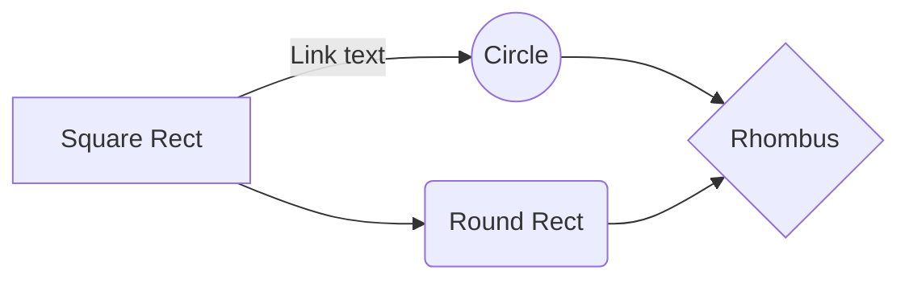

# Speedometer ESP32 project
 *Thanks Mr.H3 for teaching us*

	

> Our Team : 
	 Bùi Đức Hiền ,
	Phạm Minh Quân ,
	Phan Thị Mai Linh , 
	Lê Trung Kiên .
> 
This project base on arduino and esp32 
## Requirement

 - A modern PC / Laptop
 - ESP32 board
 -  MPU-6050 - Accelerometer and Gyro (GY-521)
 - 128x32 I2C OLED graphic display
 - Testboard and jumper
## Install Software

> 1. install Adruno IDE 
> 2. install ESP32 SDK
> 3. install other component libraries

And this will produce a flow chart:

